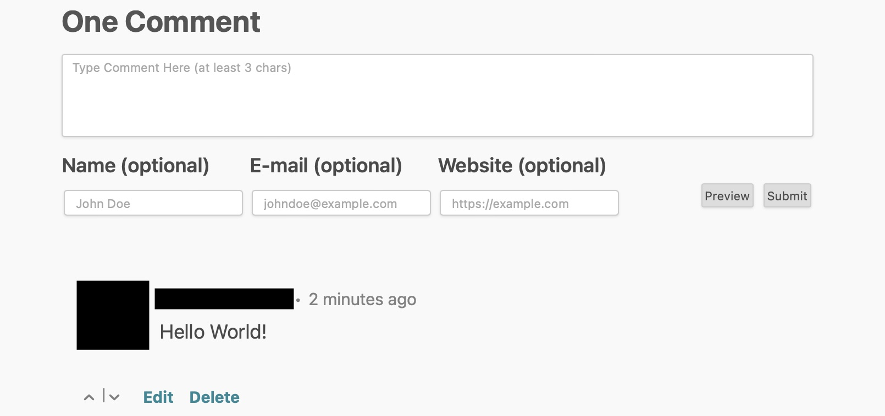

<!--
N.B.: This README was automatically generated by https://github.com/YunoHost/apps/tree/master/tools/README-generator
It shall NOT be edited by hand.
-->

# Isso pour YunoHost

[](https://dash.yunohost.org/appci/app/isso)  

[](https://install-app.yunohost.org/?app=isso)

*[Read this readme in english.](./README.md)*

> *Ce package vous permet d’installer Isso rapidement et simplement sur un serveur YunoHost.
Si vous n’avez pas YunoHost, regardez [ici](https://yunohost.org/#/install) pour savoir comment l’installer et en profiter.*

## Vue d’ensemble

Isso – *Ich schrei sonst* – is a lightweight commenting server written in
Python and JavaScript. It aims to be a drop-in replacement for
[Disqus](http://disqus.com).

### Features

- **Comments written in Markdown**  
  Users can edit or delete own comments (within 15 minutes by default).
  Comments in moderation queue are not publicly visible before activation.
- **SQLite backend**  
  *Because comments are not Big Data.*
- **Disqus & WordPress Import**  
  You can migrate your Disqus/WordPress comments without any hassle.
- **Configurable JS client**  
  Embed a single JS file, 65kB (20kB gzipped) and you are done.

**Version incluse :** 0.13.0~ynh1

**Démo :** https://isso-comments.de

## Captures d’écran



## Avertissements / informations importantes

* Limitations
    * Requires a dedicated domain

* Extra information
    * The admin interface for the app is `https://yourdomain.tld/admin`
    * One app instance can only be installed for one domain
    * Please do not add a trailing `/` in the target_domain

## Documentations et ressources

* Site officiel de l’app : <https://isso-comments.de>
* Documentation officielle utilisateur : <https://isso-comments.de/docs/reference/client-config/>
* Documentation officielle de l’admin : <https://isso-comments.de/docs/reference/server-config/>
* Dépôt de code officiel de l’app : <https://github.com/posativ/isso>
* Documentation YunoHost pour cette app : <https://yunohost.org/app_isso>
* Signaler un bug : <https://github.com/YunoHost-Apps/isso_ynh/issues>

## Informations pour les développeurs

Merci de faire vos pull request sur la [branche testing](https://github.com/YunoHost-Apps/isso_ynh/tree/testing).

Pour essayer la branche testing, procédez comme suit.

``` bash
sudo yunohost app install https://github.com/YunoHost-Apps/isso_ynh/tree/testing --debug
ou
sudo yunohost app upgrade isso -u https://github.com/YunoHost-Apps/isso_ynh/tree/testing --debug
```

**Plus d’infos sur le packaging d’applications :** <https://yunohost.org/packaging_apps>