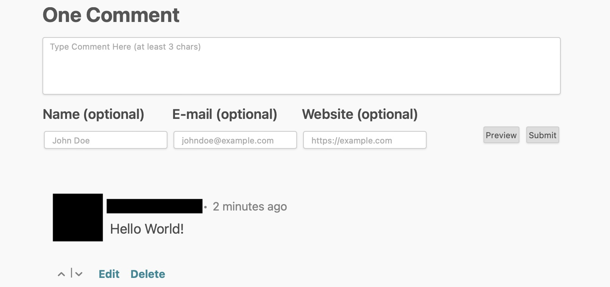

<!--
NOTA: Este README foi creado automáticamente por <https://github.com/YunoHost/apps/tree/master/tools/readme_generator>
NON debe editarse manualmente.
-->

# Isso para YunoHost

[](https://ci-apps.yunohost.org/ci/apps/isso/)  

[](https://install-app.yunohost.org/?app=isso)

*[Le este README en outros idiomas.](./ALL_README.md)*

> *Este paquete permíteche instalar Isso de xeito rápido e doado nun servidor YunoHost.*  
> *Se non usas YunoHost, le a [documentación](https://yunohost.org/install) para saber como instalalo.*

## Vista xeral

Isso – *Ich schrei sonst* – is a lightweight commenting server written in Python and JavaScript. It aims to be a drop-in replacement for
[Disqus](http://disqus.com).

### Features

- Comments written in Markdown
- SQLite backend
- Disqus & WordPress Import
- Configurable JS client 

**Versión proporcionada:** 0.13.0~ynh5

**Demo:** <https://isso-comments.de>

## Capturas de pantalla



## Documentación e recursos

- Web oficial da app: <https://isso-comments.de>
- Documentación oficial para usuarias: <https://isso-comments.de/docs/reference/client-config/>
- Documentación oficial para admin: <https://isso-comments.de/docs/reference/server-config/>
- Repositorio de orixe do código: <https://github.com/posativ/isso>
- Tenda YunoHost: <https://apps.yunohost.org/app/isso>
- Informar dun problema: <https://github.com/YunoHost-Apps/isso_ynh/issues>

## Info de desenvolvemento

Envía a túa colaboración á [rama `testing`](https://github.com/YunoHost-Apps/isso_ynh/tree/testing).

Para probar a rama `testing`, procede deste xeito:

```bash
sudo yunohost app install https://github.com/YunoHost-Apps/isso_ynh/tree/testing --debug
ou
sudo yunohost app upgrade isso -u https://github.com/YunoHost-Apps/isso_ynh/tree/testing --debug
```

**Máis info sobre o empaquetado da app:** <https://yunohost.org/packaging_apps>
